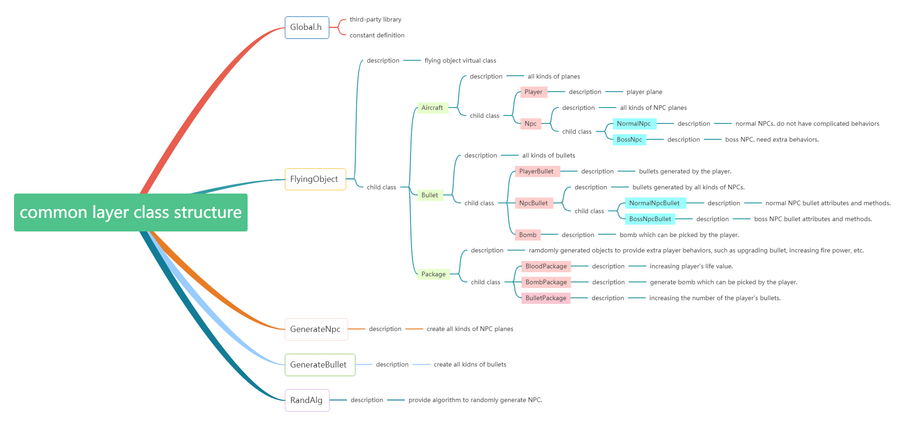
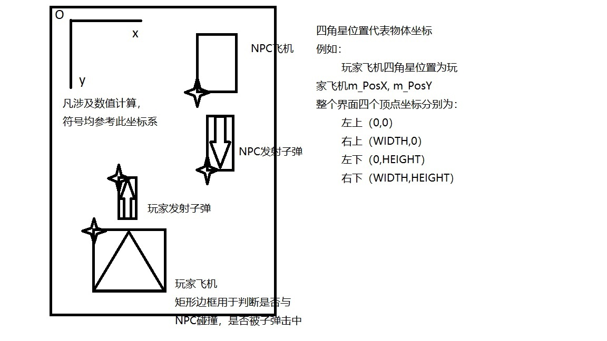

# common 层类结构



# 游戏界面说明



# common 层类使用方法示例

``` cpp
//this main file is an example showing how to include common layer files
//only need to add #include "includeHeader.h"

#include "pch.h"
#include "includeHeader.h"

int main() 
{
	std::cout << "running correctly" << std::endl;
	return 0;
}
```